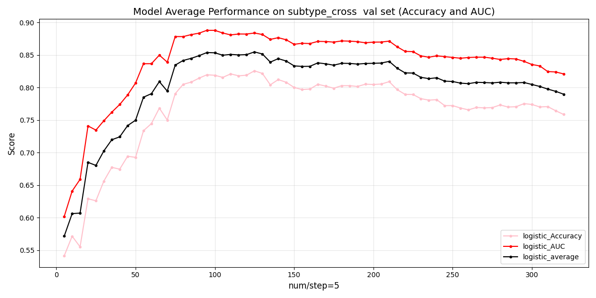
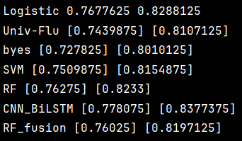
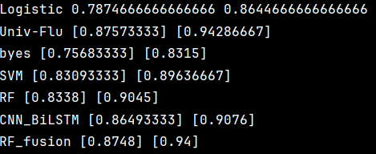

### Univ-flu-based-on-fewer-residues
---
是一个预测甲型流感病毒抗原变异的通用模型，它使用了一定的技巧筛选出了通用的对抗原变异有贡献的残基，并且使用了更少的特征更简单的模型就媲美之前的模型。

在各 .py文件最前面几行有对该文件的描述，想要跑通源码，只需将文件夹下载下来，转移到你喜欢IDE中，随便选择其中一个文件就可以直接运行（里面有sklearn，pytorch，pandas等基础包，请先自行pip install或conda install）
# 只用八维向量，观察位点数带来的影响

# 跨亚型表现

# 亚型内表现

